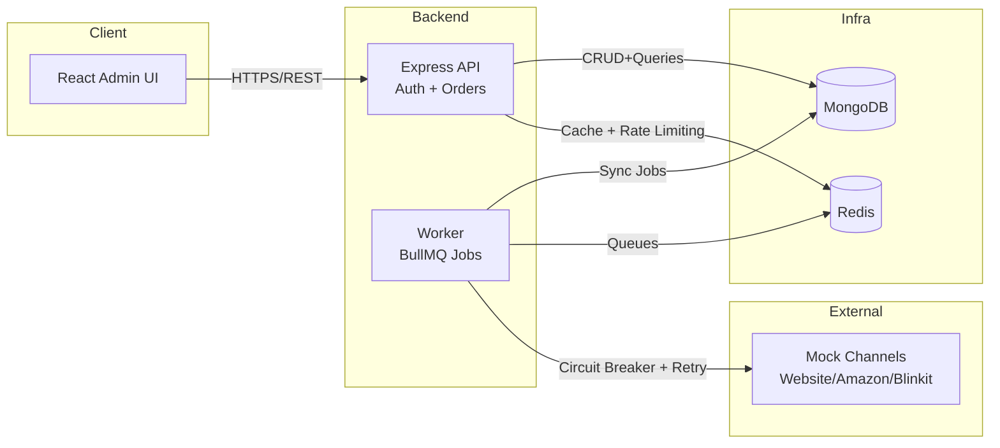

# Palmonas Admin CRM — Technical Documentation (MVP)

## 1. System Design

### 1.1 High-level Architecture

### 1.2 Component-level Architecture

- `frontend/`: React + Vite SPA for admin users
- `backend/`: Express API (modular monolith)
  - `modules/auth`: users, JWT, RBAC
  - `modules/orders`: order listing, search, status updates
  - `modules/integrations`: channel adapters and resilience patterns
  - `modules/health`: liveness/readiness
  - `lib/*`: logging, config, metrics, request context, Mongo, Redis
- `worker/`: background jobs
  - `jobs/syncOrders`: fetch external orders and upsert into Mongo
  - `integrations/channelAdapters`: circuit-breaker + cache for channels
- `mock-channels/`: simple Express service simulating 3 platforms

### 1.3 Database Schema

#### Users

- `email` (unique, indexed)
- `passwordHash`
- `role` (`admin` | `viewer`)
- `createdAt`, `updatedAt`

#### Orders

- `externalId` (per-channel ID)
- `channel` (`website` | `amazon` | `blinkit`)
- `customer`:
  - `name`
  - `phone`
  - `email?`
- `items[]`:
  - `sku`
  - `name`
  - `qty`
  - `price`
- `total`, `currency`
- `status` (`PLACED` | `CONFIRMED` | `SHIPPED` | `DELIVERED` | `CANCELLED`)
- `statusHistory[]`:
  - `status`
  - `changedAt`
  - `changedBy?`
- Indexes:
  - `{ externalId, channel }` unique
  - `{ createdAt: -1 }`
  - `{ status: 1, createdAt: -1 }`
  - `{ channel: 1, createdAt: -1 }`

### 1.4 API Contract (Highlights)

- `POST /auth/login` → `{ accessToken, refreshToken, user }`
- `POST /auth/refresh` → `{ accessToken }`
- `GET /auth/me` → `{ user }`
- `GET /orders` → `{ orders, pagination }`
  - Query params: `page`, `limit`, `channel`, `status`, `search`, `sortBy`, `sortOrder`
- `GET /orders/:id` → `{ order }`
- `PATCH /orders/:id/status` → `{ order }` (admin only)
- `GET /healthz`, `GET /readyz`, `GET /metrics`, `GET /docs`

## 2. Resilience & Reliability

### 2.1 Error Handling Strategy

- Central `AppError` class for known errors with HTTP status + code
- Global Express error middleware for structured JSON responses
- Logging at appropriate levels:
  - `info`: successful operations
  - `warn`: client errors / degraded states
  - `error`: server / integration failures

### 2.2 Retry & Circuit Breaker

- Worker uses `opossum` circuit breaker around external channel calls:
  - Opens after repeated failures (configurable)
  - Half-open / close transitions logged
- Fallback:
  - Use Redis cached results if live call fails
  - If no cache, job fails and can be retried
- BullMQ handles job retry/backoff semantics (in worker).

### 2.3 Failover & Degradation

- If mock channels are down:
  - Preflight logs warning but API still starts
  - Sync jobs either:
    - Use cached data
    - Fail fast while recording failure
- API remains functional for:
  - Authentication
  - Reading existing orders
  - Updating statuses

### 2.4 Monitoring & Alerting Strategy

- Prometheus metrics:
  - `http_requests_total`
  - `http_request_duration_seconds` (histogram)
- Health/readiness endpoints for Kubernetes-style probes.
- Logs are structured JSON (suitable for ELK/CloudWatch/Stackdriver).
- Alerts (out of scope to wire fully) would be set on:
  - Elevated error rate
  - High p95 latency
  - Circuit breaker open duration

## 3. Performance & Scalability

### 3.1 Load Testing

- Tool: **k6**
- Script: `load-test/k6-orders.js`
  - Scenarios:
    - Normal: constant 20 VUs
    - Peak: ramp to 100 VUs
    - Stress: ramp arrival rate up to 200 req/s
  - Thresholds:
    - p95 < 500ms
    - error rate < 1%

### 3.2 Bottlenecks & Optimization

- Primary bottlenecks:
  - MongoDB query latency under high concurrency
  - API CPU/memory under stress scenarios
- Optimizations:
  - Indexed query fields (channel, status, createdAt)
  - Pagination on all list endpoints
  - Redis caching for order lists (30 seconds TTL)
  - Connection pooling by drivers (MongoDB, Redis)

### 3.3 Scaling Strategy

- **Horizontal scaling**:
  - Multiple API replicas behind a load balancer
  - Multiple workers consuming BullMQ queues
- **Vertical scaling**:
  - Increase CPU/memory for API and MongoDB instances
- Stateless services:
  - API and worker are stateless; session state is encoded in JWT.

## 4. Security

### 4.1 Auth & RBAC

- JWT-based authentication:
  - Access token (short TTL)
  - Refresh token (longer TTL)
- RBAC:
  - `admin`: full CRUD on orders, status updates
  - `viewer`: read-only access

### 4.2 Secrets Management

- No secrets are hardcoded in codebase.
- Secrets are provided via environment variables:
  - `JWT_ACCESS_SECRET`, `JWT_REFRESH_SECRET`
  - `MONGO_ROOT_USERNAME`, `MONGO_ROOT_PASSWORD`
- For production:
  - Use a secret manager (Vault, AWS Secrets Manager, etc.)

### 4.3 API Security

- Input validation using Zod for all critical endpoints.
- Rate limiting: per-IP rate cap via `express-rate-limit`.
- XSS/Clickjacking:
  - `helmet` for security headers.
- CSRF:
  - APIs are stateless + JWT-based; recommended to use same-site cookies or CSRF tokens if cookies are introduced.
- CORS:
  - Allowed origins configured via `CORS_ORIGINS` env.

### 4.4 Dependency Security

- Dependencies are declared explicitly in `package.json`.
- Recommendation (not wired in code):
  - Run `npm audit` / Snyk in CI.

## 5. Development & Deployment

### 5.1 Local Setup

- See `README.md` and `RUN_INSTRUCTIONS.md` for detailed steps:
  - `cp .env.example .env`
  - `docker compose up --build`

### 5.2 Docker & Orchestration

- Each service has its own `Dockerfile` (Node 22 on Alpine, non-root user).
- `docker-compose.yml`:
  - Mongo, Redis, API, Worker, Mock Channels, Frontend
  - Health checks for Mongo, Redis, API, Worker, Mock Channels
  - Environment variables wired from `.env`.

### 5.3 CI/CD (Conceptual)

- Suggested pipeline:
  - `npm ci` + `npm run build` for each service
  - Run unit/integration tests
  - Run k6 load tests against staging
  - Build & push Docker images
  - Deploy via GitHub Actions / GitLab CI to container platform

## 6. Assumptions & Trade-offs

### 6.1 Assumptions

- Admin-only internal tool; limited number of concurrency scenarios.
- Orders volume is moderate (single-digit thousands per day).
- External channels provide simple JSON APIs (simulated here).

### 6.2 Technology Choices

- **Node.js + Express**: familiar ecosystem, wide library support.
- **MongoDB**: JSON-like documents align well with order data.
- **Redis**: fits both cache and queue connection needs.
- **BullMQ**: robust queueing with retries and backoff.
- **React + Vite**: fast development and modern frontend tooling.
- **k6**: scriptable and developer-friendly load testing.

### 6.3 Trade-offs

- Regex-based search for simplicity over full-text indexes.
- Redis `KEYS` for cache invalidation (acceptable at MVP scale).
- Single repo modular monolith instead of multiple microservices to reduce complexity.

## 7. AI Tools Usage

### 7.1 Tools Used

- **ChatGPT / Cursor AI** (this assistant)
  - Code generation and refactoring.
  - Documentation drafting (this file, README, implementation notes).
  - Design discussions for architecture, resilience and security patterns.

### 7.2 Use Cases

- Scaffolding Express, React, and Docker boilerplate.
- Suggesting best practices for:
  - JWT auth
  - Circuit breakers
  - Health checks and observability
  - Load testing with k6
- Generating initial versions of:
  - Swagger/OpenAPI annotations
  - Technical documentation structure

### 7.3 Productivity Impact

- Significantly faster initial scaffolding of services and configuration.
- Reduced time spent on boilerplate and reference lookups.
- Allowed focusing more on system design decisions and requirement coverage.

### 7.4 Transparency on AI-generated Code

- The majority of the initial scaffolding and documentation was AI-assisted.
- All generated code is:
  - Human-reviewable
  - Simple and idiomatic TypeScript/JavaScript/React
  - Designed to be easily refactorable by humans later

